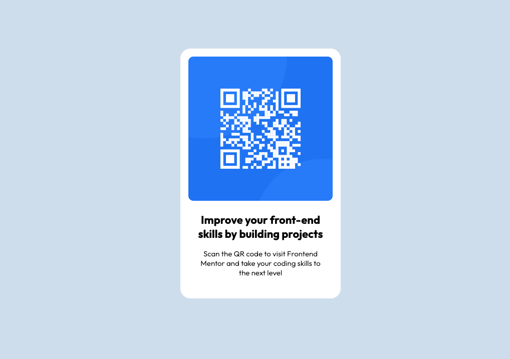

# Frontend Mentor - QR code component solution

This is a solution to the [QR code component challenge on Frontend Mentor](https://www.frontendmentor.io/challenges/qr-code-component-iux_sIO_H). Frontend Mentor challenges help you improve your coding skills by building realistic projects.

## Table of contents

- [Overview](#overview)
  - [Screenshot](#screenshot)
  - [Links](#links)
- [My process](#my-process)
  - [Built with](#built-with)
  - [What I learned](#what-i-learned)
  - [Continued development](#continued-development)
- [Author](#author)

## Overview

### Screenshot

### Links

- Solution URL: https://github.com/troyavanina/qrCodeComponent
- Live Site URL: https://troyavanina.github.io/qrCodeComponent/

## My process

This is my first challenge using Frontend Mentor, and these are my first practices with HTML and CSS.
My goal was to create a solution that looks exactly like the given design. I also aimed for clean and well-structured code, making it easy to understand and use for any colleague who might need it.

### Built with

- Semantic HTML5 markup
- CSS custom properties
- Flexbox
- Mobile-first workflow

### What I learned

Using Flexbox correctly and intuitively was my top priority. I'm sure I’ve learned a lot from this challenge!

### Continued development

I would like to keep focusing on HTML and CSS. After that, my goal is to use all the knowledge I’ve gained to learn JavaScript, React, and Vue.js.

## Author

- Frontend Mentor - [@troyavanina](https://www.frontendmentor.io/profile/troyavanina)
- LinkedIn- [@vaninatroya](https://www.linkedin.com/in/vaninatroya/)
